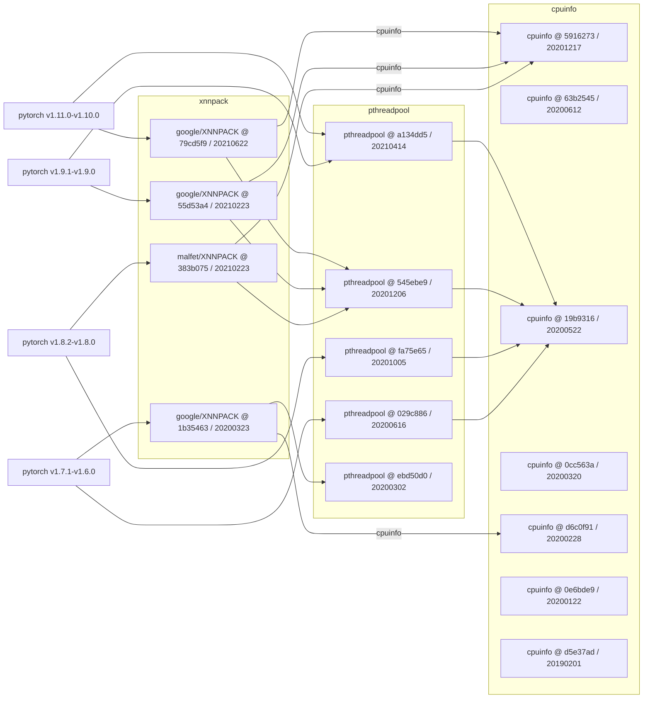

# Dependencies

```mermaid
graph LR

pytorch_1_11_0[pytorch v1.11.0-v1.10.0]
pytorch_1_9_1[pytorch v1.9.1-v1.9.0]
pytorch_1_8_2[pytorch v1.8.2-v1.8.0]
pytorch_1_7_1[pytorch v1.7.1-v1.6.0]
 
%% pytorch_1_11_0 --> cpuinfo_5916273f79a21551890fd3d56fc5375a78d1598d
pytorch_1_11_0 --> pthreadpool_a134dd5d4cee80cce15db81a72e7f929d71dd413
pytorch_1_11_0 --> xnnpack_79cd5f9e18ad0925ac9a050b00ea5a36230072db

%% pytorch_1_9_1 --> cpuinfo_5916273f79a21551890fd3d56fc5375a78d1598d
pytorch_1_9_1 --> pthreadpool_a134dd5d4cee80cce15db81a72e7f929d71dd413
pytorch_1_9_1 --> xnnpack_55d53a4e7079d38e90acd75dd9e4f9e781d2da35

%% pytorch_1_8_2 --> cpuinfo_5916273f79a21551890fd3d56fc5375a78d1598d
pytorch_1_8_2 --> pthreadpool_fa75e65a58a5c70c09c30d17a1fe1c1dff1093ae
pytorch_1_8_2 --> xnnpack_383b0752fe688a4697d763353d51c990fe65283a

%% pytorch_1_7_1 --> cpuinfo_63b254577ed77a8004a9be6ac707f3dccc4e1fd9
pytorch_1_7_1 --> pthreadpool_029c88620802e1361ccf41d1970bd5b07fd6b7bb
pytorch_1_7_1 --> xnnpack_1b354636b5942826547055252f3b359b54acff95

subgraph cpuinfo
    cpuinfo_5916273f79a21551890fd3d56fc5375a78d1598d["cpuinfo @ 5916273 / 20201217"]
    cpuinfo_63b254577ed77a8004a9be6ac707f3dccc4e1fd9["cpuinfo @ 63b2545 / 20200612"]
    cpuinfo_19b9316c71e4e45b170a664bf62ddefd7ac9feb5["cpuinfo @ 19b9316 / 20200522"]
    cpuinfo_0cc563acb9baac39f2c1349bc42098c4a1da59e3["cpuinfo @ 0cc563a / 20200320"]
    cpuinfo_d6c0f915ee737f961915c9d17f1679b6777af207["cpuinfo @ d6c0f91 / 20200228"]
    cpuinfo_0e6bde92b343c5fbcfe34ecd41abf9515d54b4a7["cpuinfo @ 0e6bde9 / 20200122"]
    cpuinfo_d5e37adf1406cf899d7d9ec1d317c47506ccb970["cpuinfo @ d5e37ad / 20190201"]
end

subgraph pthreadpool
    pthreadpool_a134dd5d4cee80cce15db81a72e7f929d71dd413["pthreadpool @ a134dd5 / 20210414"]
    pthreadpool_545ebe9f225aec6dca49109516fac02e973a3de2["pthreadpool @ 545ebe9 / 20201206"]
    pthreadpool_fa75e65a58a5c70c09c30d17a1fe1c1dff1093ae["pthreadpool @ fa75e65 / 20201005"]
    pthreadpool_029c88620802e1361ccf41d1970bd5b07fd6b7bb["pthreadpool @ 029c886 / 20200616"]
    pthreadpool_ebd50d0cfa3664d454ffdf246fcd228c3b370a11["pthreadpool @ ebd50d0 / 20200302"]

    pthreadpool_a134dd5d4cee80cce15db81a72e7f929d71dd413 --> cpuinfo_19b9316c71e4e45b170a664bf62ddefd7ac9feb5
    pthreadpool_545ebe9f225aec6dca49109516fac02e973a3de2 --> cpuinfo_19b9316c71e4e45b170a664bf62ddefd7ac9feb5
    pthreadpool_fa75e65a58a5c70c09c30d17a1fe1c1dff1093ae --> cpuinfo_19b9316c71e4e45b170a664bf62ddefd7ac9feb5
    pthreadpool_029c88620802e1361ccf41d1970bd5b07fd6b7bb --> cpuinfo_19b9316c71e4e45b170a664bf62ddefd7ac9feb5

%%    pthreadpool_a134dd5d4cee80cce15db81a72e7f929d71dd413 -- compat --> cpuinfo_5916273f79a21551890fd3d56fc5375a78d1598d
%%    pthreadpool_545ebe9f225aec6dca49109516fac02e973a3de2 -- compat --> cpuinfo_5916273f79a21551890fd3d56fc5375a78d1598d
%%    pthreadpool_fa75e65a58a5c70c09c30d17a1fe1c1dff1093ae -- compat --> cpuinfo_5916273f79a21551890fd3d56fc5375a78d1598d
end

subgraph xnnpack
    xnnpack_79cd5f9e18ad0925ac9a050b00ea5a36230072db["google/XNNPACK @ 79cd5f9 / 20210622"]
    xnnpack_55d53a4e7079d38e90acd75dd9e4f9e781d2da35["google/XNNPACK @ 55d53a4 / 20210223"]
    xnnpack_383b0752fe688a4697d763353d51c990fe65283a["malfet/XNNPACK @ 383b075 / 20210223"]
    xnnpack_1b354636b5942826547055252f3b359b54acff95["google/XNNPACK @ 1b35463 / 20200323"]

%%    xnnpack_79cd5f9e18ad0925ac9a050b00ea5a36230072db -- clog --> cpuinfo_d5e37adf1406cf899d7d9ec1d317c47506ccb970
    xnnpack_79cd5f9e18ad0925ac9a050b00ea5a36230072db -- cpuinfo --> cpuinfo_5916273f79a21551890fd3d56fc5375a78d1598d
    xnnpack_79cd5f9e18ad0925ac9a050b00ea5a36230072db --> pthreadpool_545ebe9f225aec6dca49109516fac02e973a3de2

%%    xnnpack_55d53a4e7079d38e90acd75dd9e4f9e781d2da35 -- clog --> cpuinfo_d5e37adf1406cf899d7d9ec1d317c47506ccb970
    xnnpack_55d53a4e7079d38e90acd75dd9e4f9e781d2da35 -- cpuinfo --> cpuinfo_5916273f79a21551890fd3d56fc5375a78d1598d
    xnnpack_55d53a4e7079d38e90acd75dd9e4f9e781d2da35 --> pthreadpool_545ebe9f225aec6dca49109516fac02e973a3de2

%%    xnnpack_383b0752fe688a4697d763353d51c990fe65283a -- clog --> cpuinfo_d5e37adf1406cf899d7d9ec1d317c47506ccb970
    xnnpack_383b0752fe688a4697d763353d51c990fe65283a -- cpuinfo --> cpuinfo_5916273f79a21551890fd3d56fc5375a78d1598d
    xnnpack_383b0752fe688a4697d763353d51c990fe65283a --> pthreadpool_545ebe9f225aec6dca49109516fac02e973a3de2

%%    xnnpack_1b354636b5942826547055252f3b359b54acff95 -- clog --> cpuinfo_d5e37adf1406cf899d7d9ec1d317c47506ccb970
    xnnpack_1b354636b5942826547055252f3b359b54acff95 -- cpuinfo --> cpuinfo_d6c0f915ee737f961915c9d17f1679b6777af207
    xnnpack_1b354636b5942826547055252f3b359b54acff95 --> pthreadpool_ebd50d0cfa3664d454ffdf246fcd228c3b370a11
end
```
